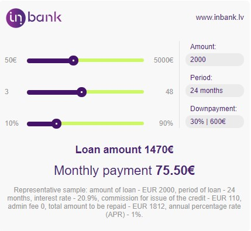

# Prestashop 'hire-purchase' calculator module
----------------------------------------------------
### Personal takeaways:
In this project I've learned to create a custom module of Prestashop
that has a hire-purchase calculator and custom input fields.
 ----------------------------------------------------
### Functionality:
1. The calculator appears next to the product in the product page.
2. It shows different types of hire-purchase possibilities without refreshing the page by sliding the parameters circles.
3. The parameters can be changed by the user in the back-office.
